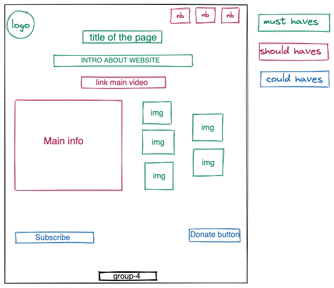

# All About Trees

---

## Wireframe

## Logo of the page

## User Story Dependencies

`As an activist I can find the logo of the page`

---

## 0.Setup

- web page frame work in html
- css style
- link all components to the right element

## Title

**As an activist I can find the title of the page..**

- The web title is centered and easy to find

> Intro is short and well descriptive with some tree images/icons that build to
> with hover-over effect

- write short and descriptive main content about trees
- use green as main color and them

## Nav

- navigation bar with different parts of pages

## Media link

- add relevant video link with important information about trees impact to the
  planet

## Main information

- paragraph describing trees
- add descriptive photos

## Buttons

- to subscribe
- to donate
